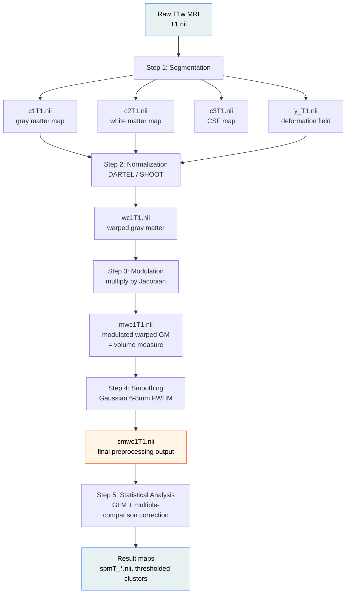

## VBM Workflow Diagram

```mermaid
flowchart TD
    A[Raw T1w MRI<br/>T1.nii] --> B[Step 1: Segmentation]
    B --> C[c1T1.nii<br/>gray matter map]
    B --> D[c2T1.nii<br/>white matter map]
    B --> E[c3T1.nii<br/>CSF map]
    B --> F[y_T1.nii<br/>deformation field]

    C --> G[Step 2: Normalization<br/>DARTEL / SHOOT]
    D --> G
    F --> G
    G --> H[wc1T1.nii<br/>warped gray matter]

    H --> I[Step 3: Modulation<br/>multiply by Jacobian]
    I --> J[mwc1T1.nii<br/>modulated warped GM<br/>= volume measure]

    J --> K[Step 4: Smoothing<br/>Gaussian 6-8mm FWHM]
    K --> L[smwc1T1.nii<br/>final preprocessing output]

    L --> M[Step 5: Statistical Analysis<br/>GLM + multiple-comparison correction]
    M --> N[Result maps<br/>spmT_*.nii, thresholded clusters]

    style A fill:#e8f1f2,stroke:#4285F4,color:#000
    style L fill:#fff4e6,stroke:#FF5722,color:#000
    style N fill:#e8f1f2,stroke:#4285F4,color:#000
```

Read the file-prefix stack right-to-left to recover the pipeline history:
`s-m-w-c1` = smoothed, modulated, warped, gray matter class 1.